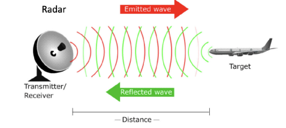
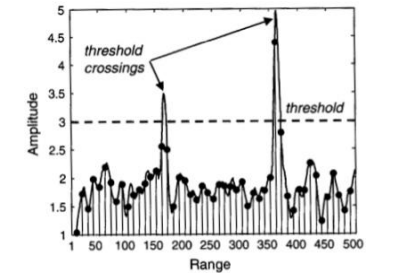
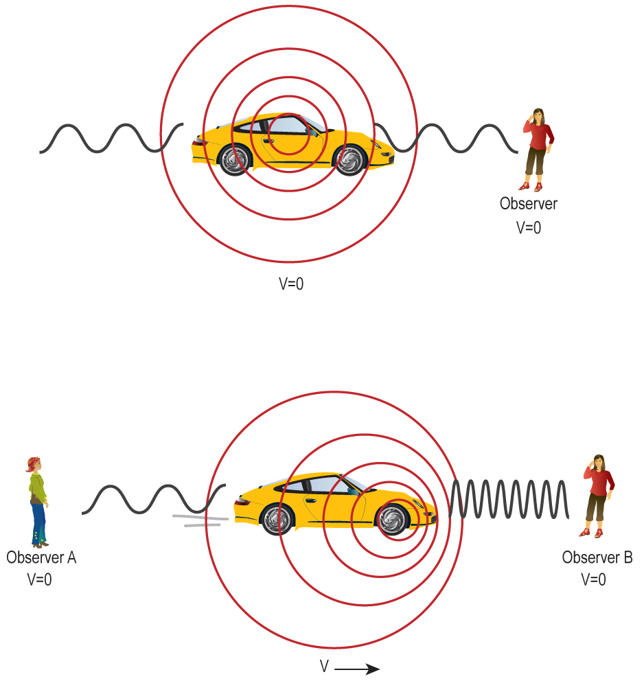
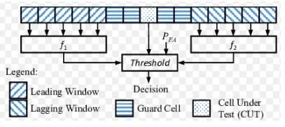
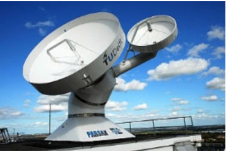
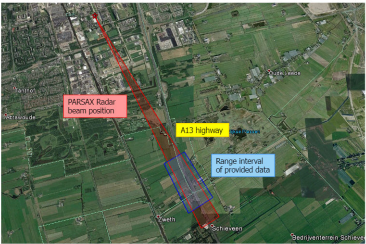

# You are only suggested to read the first two parts if you would like to know more about Dopper radar, otherwise you can directly start with reading 

In its most basic form, a radar transmits an electromagnetic pulse, and if a target is present within a certain 
angle and range, it will receive an echo, as shown

 Doppler effect and Doppler radars
 

The task at hand at the receiver is to decide if a target is present at a particular range. Therefore, it creates a 
so-called range map, obtained by sampling the received signal after some processing. 

Range map example:

## Doppler effect and Doppler radars

The Doppler effect describes the difference between the observed frequency and the emitted frequency of a 
wave when the source moves relative to the observer. The received frequency is higher when the source moves 
towards you and lower when moving away. 

<!--  -->

A Doppler radar is a special radar that utilizes the Doppler effect to produce velocity data about objects at a 
distance. Regular radars send out pulses of radio waves and detect the returned pulses. The time difference 
between the transmission and reception of a pulse is used to determine an object's range (distance). In 
addition, Doppler radars look at the phase change of the received pulse due to the Doppler effect. In this 
way, Doppler radars can also determine the velocity of objects. The range map is thereby extented by the 
Doppler dimesnion, resulting in a range-Doppler map. This video could help you understand more in detail: 
https://www.youtube.com/watch?v=NtyU6aKZ-cY

## Constant False Alarm Rate (CFAR) detection in Doppler radar

The detection efficiency of a radar is characterized by the probability of detection and the probability of false 
alarm . According to the Neyman-Pearson criterion, the optimal detector of a radar target signal against noise 
should maximize for a given . 
In general, the signal strength of the echo is unknown, and thus, we cannot define the probability of detection
. However, if we assume we know the statistics of the noise created by the receiver hardware, we can 
calculate . For a , we can define a thrershold , and the presence of the target is declared whenever the 
signal exceeds the threshold, as shown in Fig. 2.
In many practical scenarios, the noise statistic is not known as a priori and may vary temporally and spatially. 
Moreover, echoing objects may not be located in front of a clear or empty background. Instead, there will 
be clutter presesent in the received signal. In such situations, a detector designed to adapt its threshold is 
25
advantageous. In other words, the threshold level is raised and lowered to maintain a constant probability of 
false alarm. This is known as CFAR detection. 

## Basic1D CFAR architecture 

The basic 1D CFAR architecture is shown in Fig 4. The CFAR window comprises a leading and a lagging 
window, guard cells, and a cell under test (CUT). The CUT is located in the center of the CFAR window. The 
term CUT refers to the current cell to which the CFAR threshold is to be applied. Measurements contained in the 
guard cells are not used to estimate the interference statistics, as they may contain returns associated with the 
target in the CUT, which will bias the interference estimate. 
The CFAR window is moved through the data window one sample or cell at a time. At each position, a detection 
decision is made regarding the measurement in the CUT. The detection threshold applied to the CUT is derived 
from measurements in the leading and lagging window (also called training cells). The threshold is calculated 
as:
, 
where the CFAR constant is a function of the desired . is the estimated statistics from the leading and 
lagging windows which makes the threshold adaptive. 

## Visualize a real-life dataset

Load the dataset "radar.mat". This is one of the real-life datasets measured on the A13 highway by 
the PARSAX Radar (Fig. 5). The measurment setup is shown in Fig. 6. The Data_out matrix contains 
30208 consecutive range measurements. Each range measurement comprises 270 range bins. The 
correspondoing range values are provided in the range vector. The consecutive measurements are 
obtained by transmitting a radar signal ever milisecond (variable Ts). The time axis for the consecutive 
measurements is referred to as slow time.

